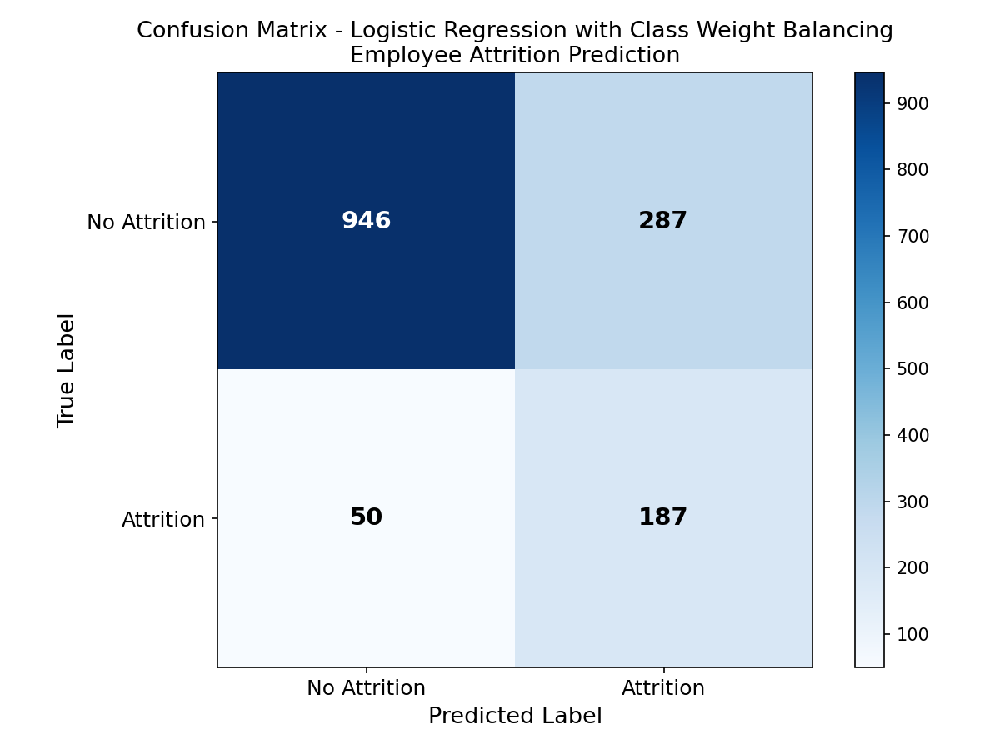
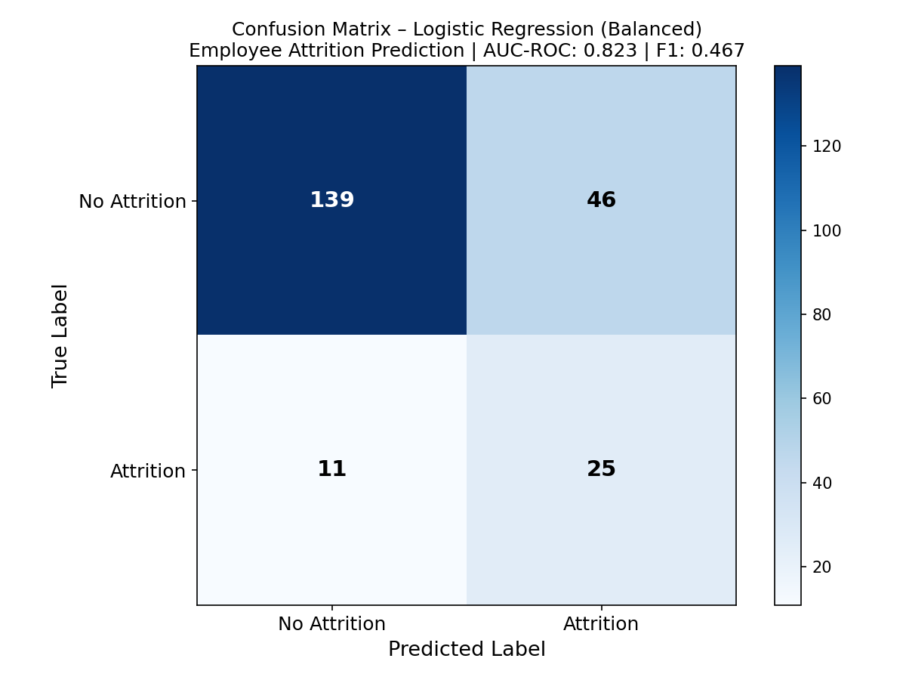
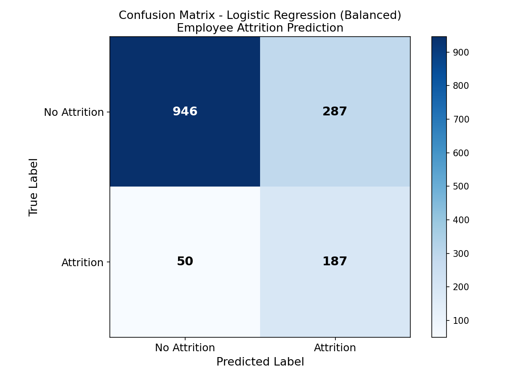

# V2 Logistic Regression

This branch improves on the V1 baseline by fixing all preprocessing issues, removing protected attributes, switching to appropriate metrics, and adding cross-validation. The objective was to test whether logistic regression was suitable if the surrounding conditions were properly implemented.

---

## Prompts Used

### Prompt 2a: Run on Haiku 4.5, Sonnet 4.6 and Opus 4.6

Click to expand prompt 2a

> You are an expert Python data scientist. I am providing you with an existing machine learning script (V1b) and the IBM HR Analytics Employee Attrition dataset. Before writing any code, read both files carefully. Examine the column names, data types and class distribution of the target variable in the dataset. Examine the structure and limitations of the existing code.
Improve the existing script by making the following changes:
Drop these constant columns before any processing: EmployeeCount, EmployeeNumber, StandardHours, Over18
Separate Age, Gender and MaritalStatus into a separate audit dataframe before training; these must not appear in the training features
Replace LabelEncoder with OneHotEncoder for nominal categorical variables (JobRole, Department, EducationField, BusinessTravel, MaritalStatus) and apply StandardScaler to continuous numeric features; use a ColumnTransformer to apply both in a single pipeline
Use LogisticRegression with class_weight="balanced" to address class imbalance
Remove accuracy as a headline metric; evaluate using AUC-ROC, F1-score, precision and recall on the positive class (Attrition = Yes) only
Use StratifiedKFold with 5 folds for cross-validation; ensure the class imbalance is preserved across every split
Plot and save a confusion matrix heatmap as a PNG file
Once you have written the code, do the following before returning it:
Re-read the dataset and verify every column name used in the script matches the actual dataset exactly
Confirm no protected attributes (Age, Gender, MaritalStatus) appear in the feature matrix
Confirm AUC-ROC and F1 are calculated on the positive class only
Identify any remaining weaknesses and fix them
Follow these coding conventions strictly:
All variable names must use camelCase
All comments must start directly after the # with no space and must explain why the decision was made, not just what the code does (e.g. #OneHotEncoder avoids false ordinal relationships in nominal categories)
Return only the final Python script with no explanation.

### Prompt 2b: Run on Sonnet 4.6 to produce attritionV2b_Sonnet_with_traintest.py

This prompt added a held-out test split to V2b so its performance could be compared directly against V4 on an identical 85/15 split.

Click to expand prompt 2b

> I have a Python script for employee attrition prediction using logistic regression. I need you to add a train/test split to it so its held-out test performance can be compared directly against a more complex XGBoost model (v4a).
Coding conventions — follow these exactly, no exceptions:
All variable names must be camelCase (first word lowercase, subsequent words capitalised e.g. testSize, yTrainTarget)
Comments must use #comment format with no space between the hashtag and the comment text
The change required:
Add a stratified train/test split (test size 15%, random_state=42) before the cross-validation block. The cross-validation should run on the training set only. Then evaluate the final model on the held-out test set and report AUC-ROC, F1, Precision, and Recall at threshold 0.5 for the test set. Also update the confusion matrix to reflect test set performance rather than cross-validation out-of-fold predictions. Keep all existing cross-validation output as well so both CV and held-out metrics are visible.
Do not change anything else — keep all variable names, comments, preprocessing logic, the pipeline structure, and the chart formatting exactly as they are. Only add what is needed for the train/test split and held-out evaluation.

---

## Files
| File | Description |
|------|-------------|
| `attritionV2a_Haiku_initial.py` | Haiku 4.5 output: hardcoded incorrect file path, one fix required |
| `attritionV2a_Haiku_final.py` | Haiku 4.5 fixed and working |
| `attritionV2b_Sonnet_initial.py` | Sonnet 4.6 output: ran first time |
| `attritionV2b_Sonnet_with_traintest.py` | Sonnet re-evaluated on identical 85/15 split for fair comparison with V4: generated using prompt 2b |
| `attritionV2c_Opus_initial.py` | Opus 4.6 output: ran first time but used handle_unknown="error" and tested on training data |

---

## Key Improvements Over V1
- OneHotEncoder replaces LabelEncoder for nominal variables, removes false ordinal relationships
- StandardScaler applied, prevents MonthlyIncome dominating due to magnitude
- class_weight="balanced", model no longer optimises for majority class only
- Protected characteristics removed from training features
- AUC-ROC, F1, precision and recall replace accuracy
- StratifiedKFold cross-validation preserves class distribution across folds

---

## Key Findings Across Models
- Haiku and Opus produced identical cross-validation results (AUC-ROC 0.818, Recall 0.713) but both tested on training data, inflating results
- Opus used handle_unknown="error" which would crash on unseen categories
- Sonnet used handle_unknown="ignore" and cross_val_predict, testing on unseen data, lower but more honest: AUC-ROC 0.817, Recall 0.717
- V1b caught 0 true positives; V2b caught 170/237, a decisive improvement
- Sonnet selected as primary model for V3 on the basis of methodological correctness
- V2b re-evaluated on 85/15 held-out split confirmed 0.823 AUC and 69.4% recall, logistic regression remains the strongest discriminator by AUC across all versions

---

## Results
| Model | AUC-ROC | Recall | Notes |
|-------|---------|--------|-------|
| V2a Haiku | 0.818 | 0.713 | Tested on training data — inflated |
| V2b Sonnet | 0.817 | 0.717 | Tested on unseen data — reliable |
| V2b Sonnet (85/15 rerun) | 0.823 | 0.694 | Re-evaluated for fair comparison with V4 |
| V2c Opus | 0.818 | 0.713 | Tested on training data — inflated |

---

## Figures

### V2a Haiku Confusion Matrix

### V2b Sonnet Confusion Matrix

### V2b Sonnet Confusion Matrix (85/15 rerun)

### V2c Opus Confusion Matrix

