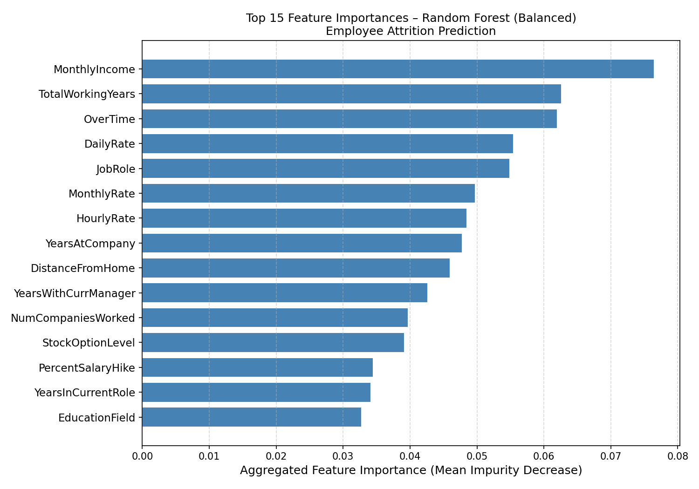
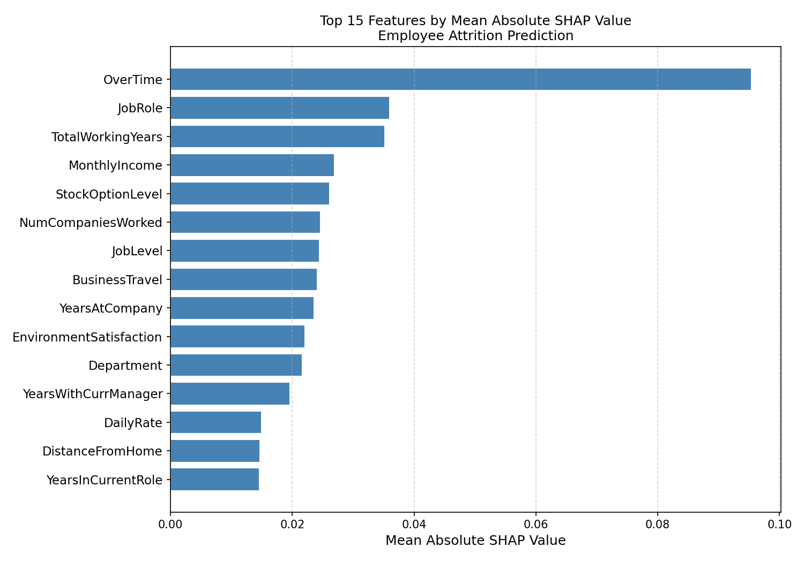
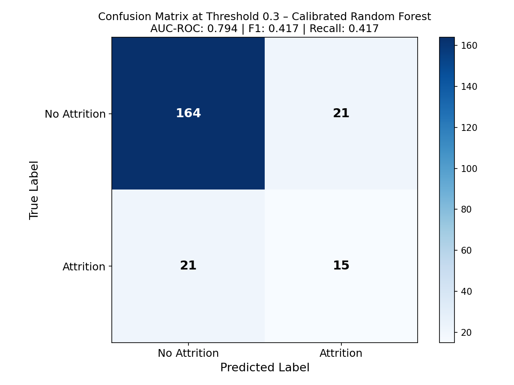
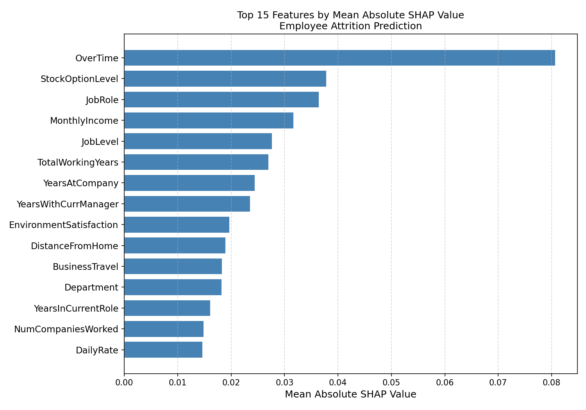

# V3 Random Forest

This branch upgrades the classifier from logistic regression to Random Forest, adds per-employee SHAP explanations, probability calibration, and threshold tuning. Sonnet 4.6 was the primary model; Haiku 4.5 was the comparison. Haiku required 3 debug iterations and was dropped after fix3 still failed to run. Sonnet required one fix and was resolved in a single round.

---

## Prompts Used

### Prompt 3a: Run on Haiku 4.5 and Sonnet 4.6

Click to expand prompt 3a

<pre>
You are an expert Python data scientist. I am providing you with an existing machine learning script (attritionV3a_Sonnet.py) and the IBM HR Analytics Employee Attrition dataset. Before writing any code, read both files carefully. The preprocessing pipeline is correct and must not be changed. You are improving the Random Forest classifier, fixing the Oracle output, and adding threshold tuning.
Make the following improvements:
1. Hyperparameter tuning:
- Use GridSearchCV with StratifiedKFold (5 folds) to tune the Random Forest on the training set only
- Use scoring="recall" because catching employees who will leave is more important than avoiding false alarms
- Search across the following parameter grid:
  n_estimators: [100, 300, 500]
  max_depth: [None, 10, 20]
  min_samples_split: [2, 5, 10]
  min_samples_leaf: [1, 2, 4]
  max_features: ["sqrt", "log2"]
  max_samples: [0.7, 0.8, None]
- Print the best parameters found
- Train the final model using the best parameters on the full training set
2. Probability calibration:
- Wrap the tuned Random Forest in CalibratedClassifierCV from sklearn.calibration before fitting
- This ensures the probability outputs are meaningful and honest; a 70% prediction should reflect a genuine 70% likelihood
3. Threshold tuning:
- Evaluate the model on the held-out test set at two thresholds: 0.5 and 0.3
- Report AUC-ROC, F1, Precision and Recall on the positive class (Attrition = Yes) at both thresholds
- Print a clear comparison table showing both sets of results
- Use the 0.3 threshold for the Oracle output and confusion matrix
4. Fix the Oracle output using SHAP:
- Install and import shap
- After fitting the final model, use shap.TreeExplainer to compute SHAP values for each employee in the held-out test set
- For every employee in the test set where the predicted probability exceeds 0.3, output:
  - Their attrition probability as a percentage
  - Their top 3 features with the highest absolute SHAP values for that specific employee (not global feature importance)
  - A retention suggestion for each of the top 3 features
- Print the Oracle output for the first 5 flagged employees only
5. Figures:
- Plot and save the top 15 features by mean absolute SHAP value as a horizontal bar chart; save as "v3_sonnet_fix1_shap_importance.png"
- Plot and save the confusion matrix heatmap at threshold 0.3 on the held-out test set; save as "v3_sonnet_fix1_confusion_matrix.png"
Once you have written the code, do the following before returning it:
1. Verify GridSearchCV only uses the training set and the test set is never touched during tuning
2. Confirm SHAP values are computed per employee, not using global feature importances
3. Confirm both threshold results (0.5 and 0.3) are reported clearly
4. Confirm no protected attributes appear in the feature matrix
5. Confirm AUC-ROC and F1 are calculated on the positive class only
6. Identify any remaining weaknesses and fix them
Follow these coding conventions strictly:
- All variable names must use camelCase
- All comments must start directly after the # with no space and must explain why the decision was made, not just what the code does
Return only the final Python script with no explanation.
<pre>

---

### Prompt 3b: Run on Sonnet 4.6 to produce attritionV3a_Sonnet_final.py

Click to expand prompt 3b

<pre>
You are an expert Python data scientist. I am providing you with an existing machine learning script (attritionV3a_Sonnet_fix1.py) and the IBM HR Analytics Employee Attrition dataset. Before writing any code, read both files carefully. The preprocessing pipeline is correct and must not be changed. You are making the following specific improvements only — do not change anything else.
Make the following changes:
1. Change the train/test split from 80/20 to 85/15
   Update the test_size parameter from 0.20 to 0.15. This gives the model more training data which helps it learn the minority attrition class better.
2. Replace GridSearchCV with RandomizedSearchCV
   Import RandomizedSearchCV from sklearn.model_selection and replace the GridSearchCV call with RandomizedSearchCV. Set n_iter=40 and keep scoring='recall', cv=stratifiedKfold, n_jobs=-1, verbose=1, and refit=True. Keep the same parameter grid but add 0.3 as an additional option in the max_features list alongside 'sqrt' and 'log2'. This samples 40 random combinations rather than exhaustively testing all combinations, finding near-optimal parameters in a fraction of the time while covering a broader search space.
3. Change calibration method from isotonic to sigmoid
   In the CalibratedClassifierCV call, change method='isotonic' to method='sigmoid'. Sigmoid calibration fits a simpler S-curve and is more stable than isotonic when the minority class is small, which it is here at roughly 16% attrition.
4. Raise the minimum n_estimators in the parameter grid to 200
   Change the n_estimators list from [100, 300] to [200, 300, 500]. With more training data from the 85/15 split, 100 trees is insufficient for the ensemble to stabilise. A minimum of 200 ensures every configuration tested produces a reliable forest.
Do not change:
- The preprocessing pipeline
- The SHAP implementation
- The Oracle output logic
- The threshold comparison table
- The figure filenames, but change them to v3_sonnet_fix2_shap_importance.png and v3_sonnet_fix2_confusion_matrix.png
Follow these coding conventions strictly:
- All variable names must use camelCase
- All comments must start directly after the # with no space and must explain why the decision was made, not just what the code does
Return only the final Python script with no explanation.
<pre>

---

### Haiku Debug Iterations
Haiku 4.5 required 3 debug iterations, all caused by the same root issue: SHAP's TreeExplainer returns a 3D array but the code expected 2D. Each fix was generated by pasting the error message directly back into Haiku. Fix3 still failed to run and Haiku was dropped, it could not pre-empt and resolve issues Sonnet could handle in one round.

### Sonnet Debug fix1
Sonnet 4.6 required one fix, generated by pasting the error message back into Sonnet. Resolved in a single round.

---

## Files
| File | Description |
|------|-------------|
| `attritionV3a_Sonnet_initial.py` | Sonnet 4.6 initial output from prompt 3a, required one fix |
| `attritionV3a_Sonnet_fix1.py` | Sonnet fix, error message pasted back in, resolved in one round |
| `attritionV3a_Sonnet_final.py` | Final Sonnet version, prompt 3b applied to fix1 |
| `attritionV3b_Haiku_initial.py` | Haiku 4.5 initial output from prompt 3a |
| `attritionV3b_Haiku_fix1.py` | Haiku fix 1, 3D array slicing attempted |
| `attritionV3b_Haiku_fix2.py` | Haiku fix 2, numpy scalar conversion attempted |
| `attritionV3b_Haiku_fix3.py` | Haiku fix 3, still failed, Haiku dropped |

---

## Key Improvements Over V2
- Random Forest replaces logistic regression, captures non-linear relationships
- GridSearchCV with scoring="recall" tunes hyperparameters to prioritise catching leavers
- CalibratedClassifierCV corrects probability outputs so predicted likelihoods are meaningful
- Threshold lowered from 0.5 to 0.3, accepts more false positives to reduce missed leavers
- SHAP TreeExplainer adds per-employee explanations, identifies top 3 drivers per individual
- RandomizedSearchCV replaces GridSearchCV in final version, broader search space in less time
- 85/15 split replaces 80/20, more training data for minority class

---

## Key Findings
- At default 0.5 threshold: recall 10.6%, only 5/47 true positives caught
- After calibration and threshold tuning to 0.3: recall improved to 46.8%, 22 true positives
- V3 final (85/15, RandomizedSearchCV): AUC-ROC 0.794, Recall 41.7%
- Random Forest significantly underperformed V2b logistic regression: Recall 46.8% vs 71.7%, AUC-ROC 0.778 vs 0.817
- On 1,470 rows with 16% positive class, Random Forest builds shallow trees that cannot generalise as reliably as logistic regression at this scale
- SHAP identified OverTime as the primary driver of individual predictions by a large margin, more actionable than global feature importance

---

## Results
| Model | Threshold | AUC-ROC | Recall | Precision | F1 |
|-------|-----------|---------|--------|-----------|-----|
| V3a Sonnet initial | 0.5 | — | 10.6% | — | — |
| V3a Sonnet fix1 | 0.3 | 0.778 | 46.8% | — | — |
| V3a Sonnet final | 0.3 | 0.794 | 41.7% | — | — |

---

## Figures

### V3a Sonnet Initial: Random Forest Feature Importance

### V3a Sonnet Fix1: Confusion Matrix

### V3a Sonnet Fix1: SHAP Importance

### V3a Sonnet Final: Confusion Matrix

### V3a Sonnet Final: SHAP Importance

