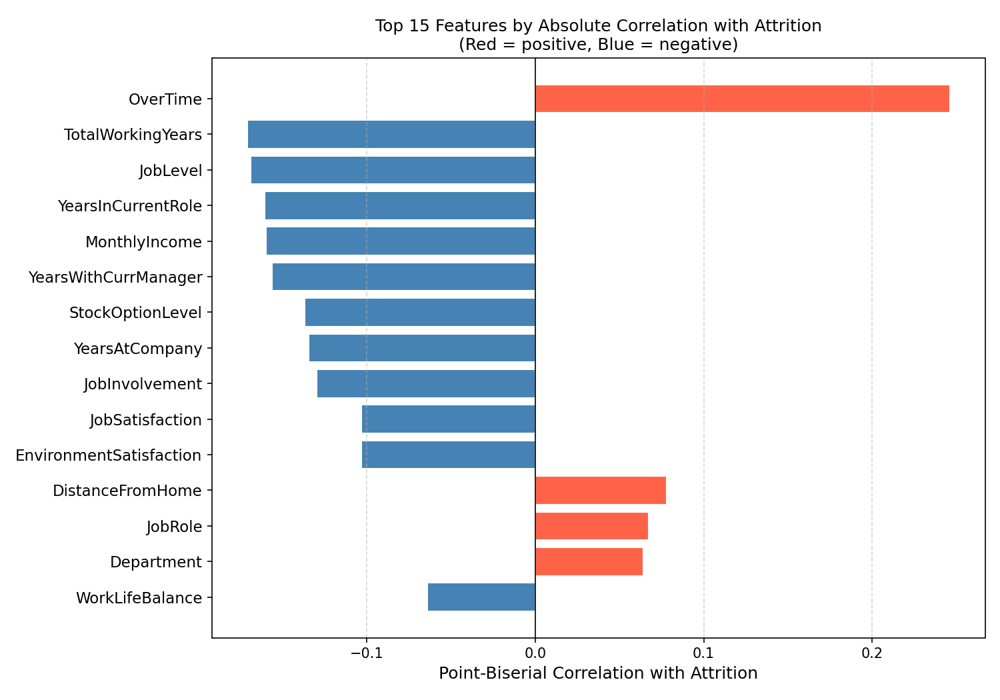
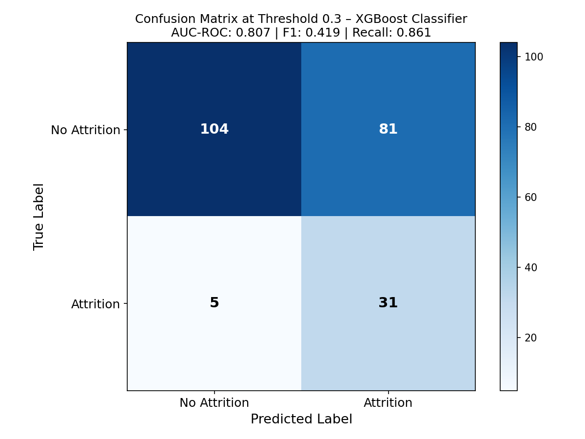
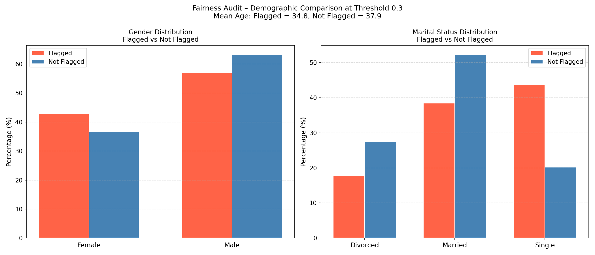
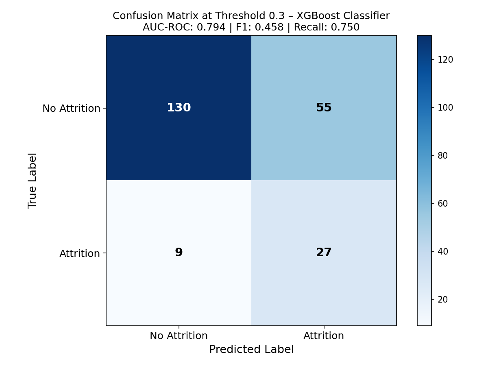
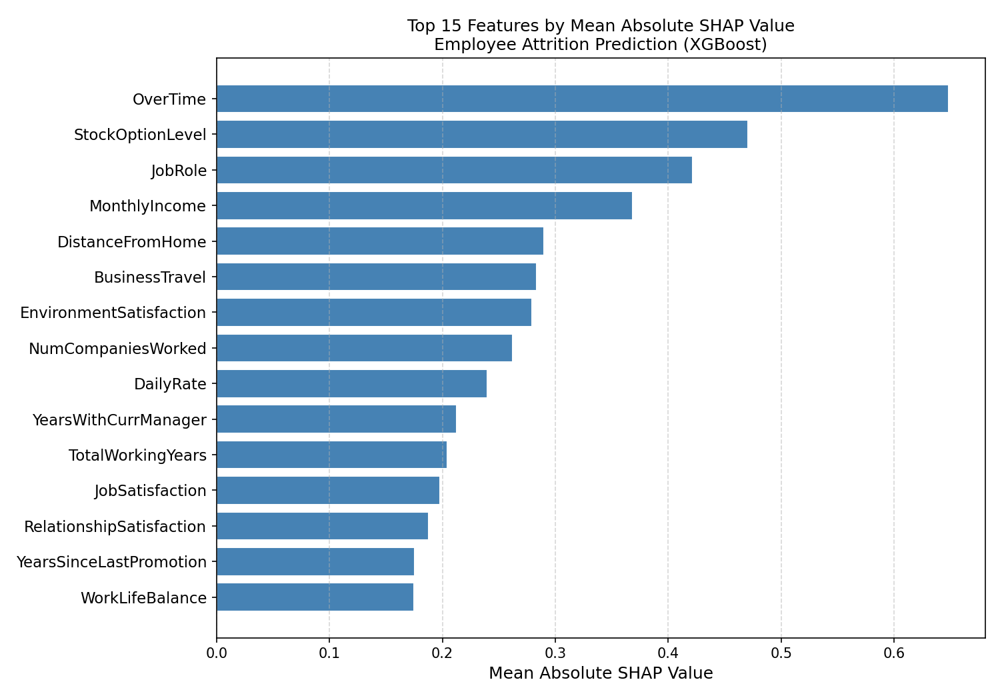
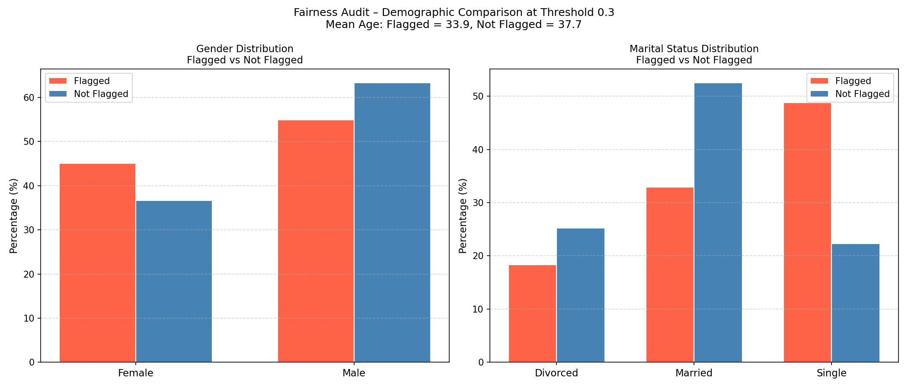
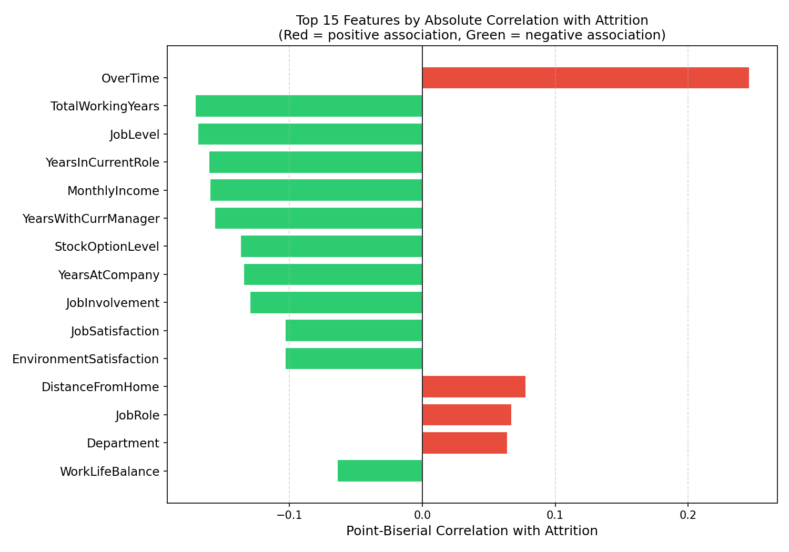
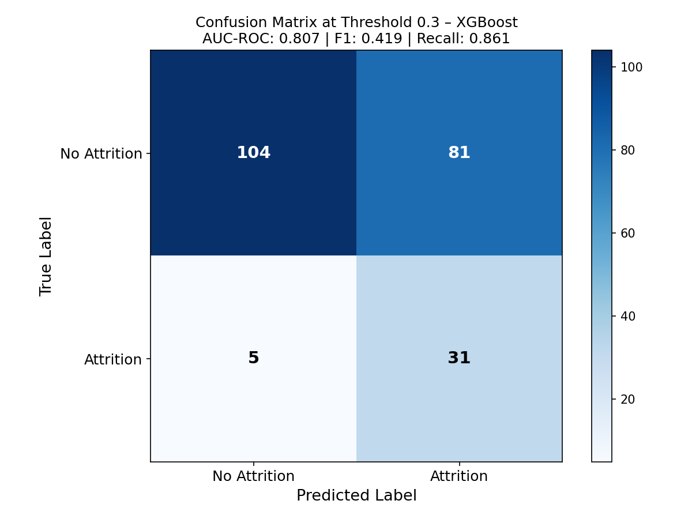
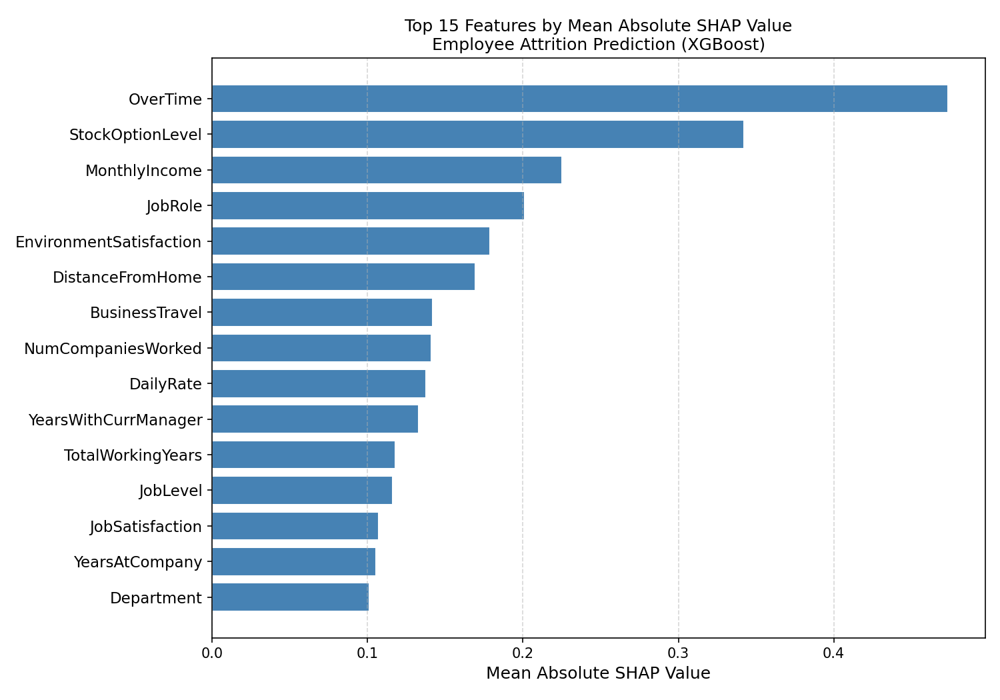
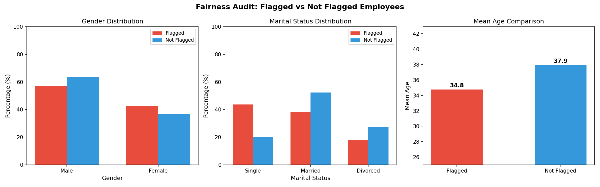

# V4 XGBoost

This branch upgrades the classifier to XGBoost, adds a correlation analysis, a fairness audit, and a final iteration testing threshold 0.4, cross-validation AUC stability, and early stopping. Sonnet 4.6 and Opus 4.6 produced identical results. Sonnet was taken forward on the basis of cleaner structural decisions. The final model is **attritionV4a_Sonnet_initial.py**. The fix1 iteration tested additional improvements which ultimately confirmed the initial version as optimal.

---

## Prompts Used

### Prompt 4a: Run on Sonnet 4.6 and Opus 4.6

Click to expand prompt 4a

<pre>
You are an expert Python data scientist. I am providing you with an existing machine learning script (attritionV3a_Sonnet_final.py) and the IBM HR Analytics Employee Attrition dataset.
Before writing any code, read both files carefully. The preprocessing pipeline is correct and must not be changed. You are upgrading the classifier to XGBoost, adding a correlation analysis, and adding a fairness audit.

Make the following changes:

1. Correlation analysis (run this before any modelling):
- Calculate the point-biserial correlation between each numeric feature and the binary attrition target (0/1)
- For categorical features that remain in the feature matrix after preprocessing, encode them as integers before calculating correlation
- Plot the top 15 features by absolute correlation with attrition as a horizontal bar chart
- Save as v4a_Sonnet_correlation_chart.png
- This provides model-independent evidence of which features are most associated with attrition before any classifier is trained

2. Classifier upgrade:
- Replace the CalibratedClassifierCV and RandomForestClassifier with XGBClassifier from xgboost
- Set scale_pos_weight=5.2 to handle class imbalance natively; this is the ratio of negative to positive class (1233/237)
- Set random_state=42 for reproducibility
- Set eval_metric='logloss' to suppress verbose output
- Remove CalibratedClassifierCV entirely; XGBoost produces well-calibrated probabilities natively
- Keep all preprocessing exactly as in the provided script

3. Hyperparameter tuning:
- Keep RandomizedSearchCV with scoring='recall', StratifiedKFold 5-fold, n_iter=40, n_jobs=-1, verbose=1, refit=True
- Use this parameter grid:
  n_estimators: [100, 300, 500]
  max_depth: [3, 5, 7]
  learning_rate: [0.01, 0.05, 0.1]
  subsample: [0.7, 0.8, 1.0]
  colsample_bytree: [0.7, 0.8, 1.0]
  min_child_weight: [1, 3, 5]
- Print the best parameters found
- Train the final model on the full training set using the best parameters

4. Evaluation:
- Keep the 85/15 stratified train/test split
- Keep the threshold comparison table at 0.5 and 0.3
- Report AUC-ROC, F1, Precision and Recall on the positive class only
- Save confusion matrix heatmap at threshold 0.3 as v4a_Sonnet_confusion_matrix.png

5. SHAP:
- Keep SHAP TreeExplainer for per-employee explanations
- Keep the Oracle output: for each employee flagged above threshold 0.3, output their probability, top 3 features by absolute SHAP value, and mapped retention suggestion
- Print first 5 flagged employees only
- Save SHAP importance chart as v4a_Sonnet_shap_importance.png

6. Fairness audit:
- After generating predictions on the held-out test set, align the test set indices with the audit dataframe (which contains Age, Gender, MaritalStatus) to retrieve the protected characteristics for each test employee
- Split test employees into two groups: flagged (predicted probability above 0.3) and not flagged
- For each group calculate:
  - Gender distribution as a percentage (Male vs Female)
  - MaritalStatus distribution as a percentage (Single vs Married vs Divorced)
  - Mean age
- Print these results clearly
- Plot a grouped bar chart comparing the demographic distributions between flagged and not flagged employees
- Save as v4a_Sonnet_fairness_audit.png

Once you have written the code, do the following before returning it:
1. Verify the held-out test set is never touched before final evaluation
2. Confirm no protected attributes appear in the feature matrix
3. Confirm the fairness audit uses index alignment to correctly match test set predictions with audit dataframe rows
4. Confirm SHAP values are computed per employee, not using global feature importances
5. Confirm AUC-ROC and F1 are calculated on the positive class only
6. Identify any remaining weaknesses and fix them

Follow these coding conventions strictly:
- All variable names must use camelCase
- All comments must start directly after the # with no space and must explain why the decision was made, not just what the code does

Return only the final Python script with no explanation.
</pre>

---

### Prompt 4b: Run on Sonnet 4.6 to produce attritionV4a_Sonnet_fix1.py

Click to expand prompt 4b

<pre>
You are an expert Python data scientist. I am providing you with an existing machine learning script (attritionV4a_Sonnet_initial.py) and the IBM HR Analytics Employee Attrition dataset. Before writing any code, read both files carefully. The preprocessing pipeline, SHAP implementation, Oracle output, fairness audit, and correlation analysis are all correct and must not be changed. You are making the following three specific improvements only — do not change anything else.

Make the following changes:

1. Add threshold 0.4 to the evaluation comparison table
   Add 0.4 as a third threshold alongside the existing 0.5 and 0.3. Calculate Precision, Recall and F1 at threshold 0.4 on the held-out test set and include it as an additional column in the printed comparison table. Do not change the Oracle output, confusion matrix, or fairness audit — these all remain at threshold 0.3. The purpose is to show the precision-recall trade-off across three operating points so the most appropriate threshold for deployment can be justified with evidence.

2. Add cross-validation AUC on the training set
   After fitting the preprocessor and transforming the training data, add a cross_val_score call using the best XGBoost estimator from RandomizedSearchCV, scoring='roc_auc', and the same StratifiedKFold used for tuning. Run this on xTrainTransformed and yTrain only — the test set must never be touched here. Print the mean and standard deviation of the cross-validation AUC scores in the following format:
   Cross-validation AUC (5-fold, training set): X.XXX +/- X.XXX
   Held-out test AUC: X.XXX
   This provides evidence of whether the model generalises consistently across different subsets of training data or whether the held-out test result is unstable.

3. Add early stopping to XGBoost
   The best parameters found by RandomizedSearchCV selected n_estimators=100, which is the minimum value in the search grid. To address this, after RandomizedSearchCV has identified the best parameters, refit the final model using those best parameters but with early stopping enabled. Create a small internal validation set by taking 15% of xTrainTransformed using a stratified split with random_state=42. Pass this as eval_set to the XGBClassifier fit call with early_stopping_rounds=20. Set n_estimators to 500 as the upper ceiling and let early stopping determine the optimal number of trees. Print the optimal number of trees found. Use this early-stopped model as bestXgbModel for all subsequent evaluation, SHAP, and fairness audit steps.

Do not change:
- The correlation analysis
- The preprocessing pipeline
- The RandomizedSearchCV setup or parameter grid
- The SHAP implementation or Oracle output
- The fairness audit
- The confusion matrix (remains at threshold 0.3)
- The figure filenames, but update them to v4a_Sonnet_final prefix throughout

Once you have written the code, do the following before returning it:
1. Verify the held-out test set is never touched before final evaluation
2. Confirm cross_val_score uses xTrainTransformed only
3. Confirm early stopping uses an internal split from xTrainTransformed only, not xTestTransformed
4. Confirm threshold 0.4 metrics are calculated on the held-out test set and appear in the comparison table
5. Confirm no protected attributes appear in the feature matrix
6. Confirm AUC-ROC and F1 are calculated on the positive class only
7. Identify any remaining weaknesses and fix them

Follow these coding conventions strictly:
- All variable names must use camelCase where the first word is fully lowercase and each subsequent word starts with an uppercase letter
- All comments must start directly after the # with no space and must explain why the decision was made, not just what the code does

Return only the final Python script with no explanation.
</pre>

---

## Why attritionV4a_Sonnet_initial.py is the Final Model

The fix1 iteration tested three additions: threshold 0.4, cross-validation AUC stability, and early stopping. Results confirmed the initial version as optimal:

- Early stopping found 273 trees as optimal but AUC-ROC fell to 0.794 and recall to 75.0%, with roughly 30 positive cases in the internal validation split, the stopping signal was too noisy to be reliable
- Cross-validation AUC on the training set was 0.805 ± 0.048, close to the held-out result of 0.794, confirming generalisation rather than memorisation
- Threshold 0.4 analysis: recall 72.2%, precision 38.2%, F1 0.500, a better balance than 0.3 (higher precision) but the initial 0.3 threshold was retained as the deployment threshold given the asymmetric cost of missing a leaver (up to £74,900) versus an unnecessary retention conversation

**attritionV4a_Sonnet_initial.py is therefore the final model**

---

## Files
| File | Description |
|------|-------------|
| `attritionV4a_Sonnet_initial.py` | **FINAL MODEL** Sonnet 4.6 output from prompt 4a |
| `attritionV4a_Sonnet_fix1.py` | Sonnet iteration testing threshold 0.4, CV AUC and early stopping, confirmed initial as optimal |
| `attritionV4b_Opus_initial.py` | Opus 4.6 output from prompt 4a, identical results to Sonnet, dropped on code structure grounds |

---

## Key Improvements Over V3
- XGBoost replaces Random Forest, sequential boosting handles minority class more effectively than parallel ensemble at this dataset size
- Correlation analysis added, model-independent evidence of feature associations before any classifier is trained
- Fairness audit added, demographic distributions compared between flagged and not-flagged employees

---

## Key Findings
- Both Sonnet and Opus produced identical results: Sonnet taken forward on cleaner code structure
- Recall 86.1% (31/36 actual leavers caught), AUC-ROC 0.807, highest recall across all versions
- V2b logistic regression still holds the highest AUC-ROC at 0.823, complexity did not improve discrimination
- XGBoost's sequential boosting made it better suited to the minority class than Random Forest, but logistic regression's linear boundary remains strongest by AUC
- Fairness audit: single employees make up 43.8% of flagged but only 20.2% of not-flagged, model learnt marital status indirectly through behavioural proxies (overtime, stock options, tenure)
- SHAP confirmed OverTime as the dominant driver of individual predictions by a large margin

---

## Results
| Model | Threshold | AUC-ROC | Recall | Precision | F1 |
|-------|-----------|---------|--------|-----------|-----|
| V4a Sonnet initial | 0.3 | 0.807 | 86.1% | — | — |
| V4a Sonnet fix1 | 0.3 | 0.794 | 75.0% | — | — |
| V4a Sonnet fix1 | 0.4 | 0.794 | 72.2% | 38.2% | 0.500 |
| V4b Opus initial | 0.3 | 0.807 | 86.1% | — | — |

---

## Figures

### V4a Sonnet Initial: Correlation Chart

### V4a Sonnet Initial: Confusion Matrix

### V4a Sonnet Initial: SHAP Importance

### V4a Sonnet Initial: Fairness Audit

### V4a Sonnet Fix1: Correlation Chart

### V4a Sonnet Fix1: Confusion Matrix

### V4a Sonnet Fix1: SHAP Importance

### V4a Sonnet Fix1: Fairness Audit

### V4b Opus Initial: Correlation Chart

### V4b Opus Initial: Confusion Matrix

### V4b Opus Initial: SHAP Importance

### V4b Opus Initial: Fairness Audit

